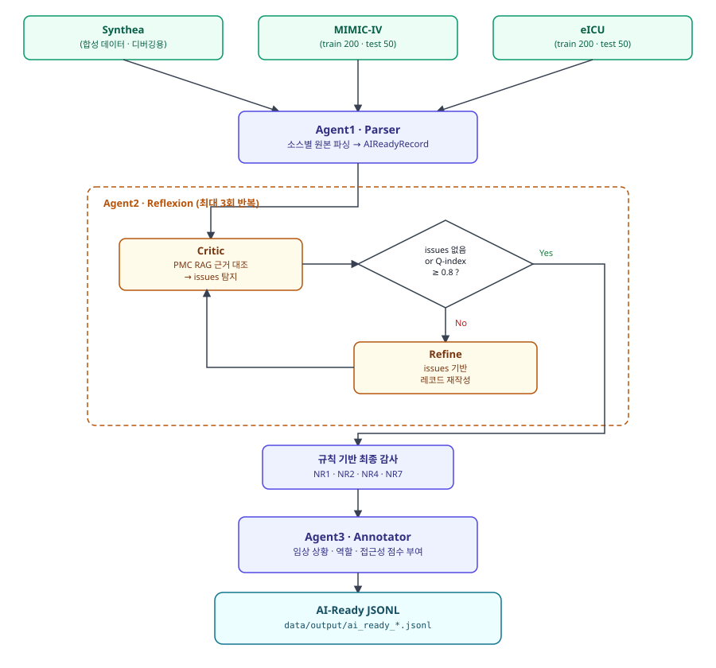

# Medical_Ready_Agent

우리는 의료 원본 데이터(Synthea / MIMIC-IV / eICU)를 LLM 멀티에이전트 파이프라인에 통과시켜,
구조화 → 팩트체크/자기수정 → 임상 컨텍스트 주석까지 끝낸 **"AI-Ready" 레코드**를 만든다.
학습·평가에 바로 쓸 수 있는 정제된 의료 데이터셋 확보가 목표다.

## 파이프라인



Parser, Critic, Refine, Annotator 네 지점 모두 같은 vLLM 서버(Qwen/Qwen3-4B)를 호출한다.

## 데이터 & 실험 설계

| 소스 | 용도 | train | test |
|---|---|---|---|
| Synthea | 초기 디버깅 (합성 데이터라 규제 없음) | - | - |
| MIMIC-IV | 본 실험 | 200건 | 50건 |
| eICU | 본 실험 | 200건 | 50건 |

Synthea로 파이프라인 로직 자체를 먼저 검증하고, 그다음 실제 임상 데이터인 MIMIC-IV·eICU에
같은 파이프라인을 적용해 결과를 비교한다. 두 소스 모두 구조화 테이블(진단/처방/검사)과
자유 텍스트 노트(discharge summary 등) 두 경로를 지원하도록 구현했고, `graph/pipeline.py`에서
`note_text` 유무로 분기한다 (`agent1.parse_*_structured` vs `agent1.parse_*_note`).

## 모델

생성은 전부 **Qwen/Qwen3-4B**로 수행한다. 파이프라인 프로세스 자체는 모델을 들고 있지 않고,
별도로 띄운 **vLLM 서버**에 OpenAI 호환 API로 요청만 보내는 구조로 만들었다 (`models/model_loader.py`).
재현성을 우선해 `ENABLE_THINKING=False`(non-thinking 모드 고정), `MAX_NEW_TOKENS=2048`,
`TEMPERATURE=0.1`로 고정했다.

## Multi-Agent 구조

### Agent1 · Parser (`agents/agent1_parser.py`)
소스별 원본 테이블/노트를 파싱해 공통 스키마(`schemas/ai_ready_schema.py`의 `AIReadyRecord`)로
변환한다. ICD-10 코드 형식 검증, 약물 단위 정규화(UCUM/RxNorm 화이트리스트), STOP 컬럼 기반
`is_active` 판정을 이 단계에서 규칙 기반으로 처리한다.

### Agent2 · Reflexion (`agents/agent2_reflexion.py`)
- **Critic**: `rag/retriever.py`로 PMC 논문에서 관련 근거를 검색해 컨텍스트로 주고, Critic LLM이
  약물 용량 오류·negation 오류·근거와의 모순 등을 찾아 `issues` 리스트로 반환한다.
- **Refine**: issues가 있으면 그걸 기반으로 레코드를 재작성한다.
- 이 과정을 issues가 없어지거나 `q_index >= QUALITY_THRESHOLD`(0.8)가 될 때까지 최대
  `MAX_REFLEXION_LOOPS`(3)회 반복하고, 그중 issue가 가장 적은 버전을 최종으로 채택한다.
- 채택된 레코드에는 규칙 기반 최종 감사(NR1/NR2/NR4/NR7)를 한 번 더 돌린다. 이 결과는 refine
  대상으로 넘기지 않고 사유 코드 기록에만 쓴다 — 빈 값을 LLM이 억지로 채우게 하면
  hallucination만 늘어나기 때문에 의도적으로 분리했다.

### Agent3 · Annotator (`agents/agent3_annotator.py`)
임상 상황(외래/응급/입원), 관련 역할(의사/환자/보호자), 가독성·정보 접근성 점수 등
`ClinicalContext`를 부여한다.

## Critic 판정 기준 (NR 코드)

`agents/criteria.py`에 golden-standard 판정 기준을 코드로 정의해뒀다. `check_type`은 판정 주체를
뜻한다 (`rule`=결정론적 파이썬 체크, `llm`=Critic LLM 판단, `gate`=별도 로직 결과에 라벨만 부여,
`upstream`=더 앞단에서 이미 차단).

| 코드 | 카테고리 | check_type | 설명 |
|---|---|---|---|
| NR1 | 데이터 공백 | rule | 필수 key의 value가 비어있거나 필드 자체 누락 |
| NR2 | 의료 정보 누락 | rule | 필드는 있으나 `Unknown`/`None` 등 플레이스홀더 값 |
| NR3 | 임상 데이터 부재 | gate | 주호소·증상이 파이프라인 최소 규격 미달로 비어있음 |
| NR4 | 인코딩/텍스트 깨짐 | rule | mojibake, 이상 특수문자 |
| NR5 | 문맥/논리 해석 불가 | llm | 임상적 선후관계 붕괴, negation 포함 구조적 불일치 |
| NR6 | 시스템/파싱 오류 | upstream | JSON 문법 오류·truncation (parse 단계에서 error로 이미 차단) |
| NR7 | 개인정보 노출 | rule | 연구원 실명·병원 코드·로컬 경로 등 파이프라인이 새로 흘린 정보 (현장 데이터 대비용 안전망) |
| NR8 | Reflexion Critic 검출 | gate | Critic LLM이 찾은 임상/구조적 모순 전체의 catch-all 라벨 |
| NR9 | 활성 진단 없음 | gate | `is_active=true` 진단이 0개 |
| NR10 | 코드-설명 불일치 | upstream | ICD 코드와 description 불일치 (파싱 단계에서 공식 크로스워크로 이미 차단) |
| NR11 | 약물 단위 오류 | llm | 투약 용량 단위 혼용(g/mg/mcg) 또는 비정상 수치 |

## 평가지표 (Q-index)

`agents/agent2_reflexion.py`의 `_calc_q_index()`로 계산하는 자체 품질 점수다.

- 1.0에서 시작
- Critic이 찾은 issue 1개당 **-0.1**
- 리플렉션 루프 1회 초과분마다 **-0.05**
- 활성 진단이 하나도 없으면 **-0.2**
- 투약·검사 관측치가 둘 다 없으면 **-0.1**
- 주호소·증상이 둘 다 없으면 **-0.1**
- 0~1 사이로 clamp

최종 `status`는 issues가 전혀 없고, 활성 진단이 있고, 주호소/증상 중 하나라도 있어야
`AI_READY`, 그렇지 않으면 `NEEDS_REVIEW`로 기록한다 (`DataStatus`, `schemas/ai_ready_schema.py`).
사람 라벨링 검증셋과의 상관관계는 아직 검증하지 못한 휴리스틱이라, 절대적인 정확도 지표가
아니라 루프 내 상대적 품질 신호로만 쓰고 있다.

## RAG (PMC 논문 근거)

`rag/pmc_vectordb.zip`(사전 빌드한 PMC 250편 임베딩, 저장소에 포함)을 `rag/retriever.py`가
최초 실행 시 자동으로 압축 해제해서 쓴다 — 별도 빌드 없이 바로 동작하게 만들었다. 코퍼스를
새로 만들거나 확장할 때는:

```bash
python data/collect_pmc.py      # NCBI PMC OA 벌크 데이터에서 논문 샘플링
python rag/build_vectordb.py    # XML 파싱·청킹·임베딩 → rag/pmc_vectordb/
```

`collect_pmc.py`는 실행한 위치 기준 `./pmc_xml_selected`에 결과를 저장하고,
`build_vectordb.py`는 `rag/pmc_xml_selected`를 읽는다. 두 경로가 서로 다르니 코퍼스를 새로
만들 때는 `rag/` 안에서 `collect_pmc.py`를 실행하거나 결과 폴더를 옮겨서 맞춰야 한다.

## MIMIC-IV / eICU 데이터 취급

`data/raw/mimic4/*`, `data/raw/eicu/*`는 `.gitignore`로 막아 git에 올리지 않는다.
PhysioNet credentialed access가 필요한 규제 데이터라서, 팀원 각자 본인 명의로 접근 승인을
받아 개별적으로 원본을 받는다. 원본이든 파생 결과물(JSONL)이든 일반 개인 클라우드 드라이브
등 비보안 경로로는 공유하지 않는다.
